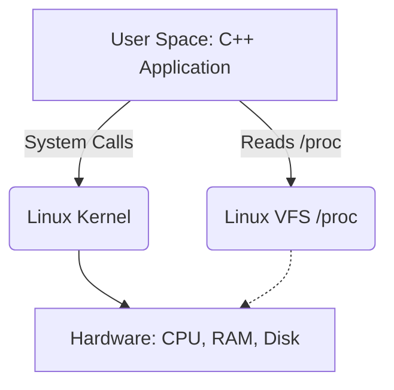
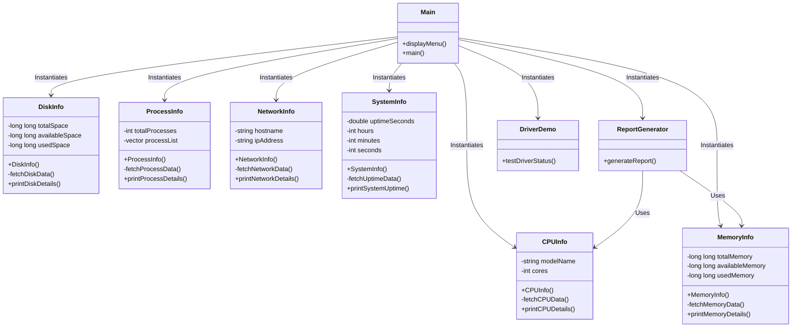
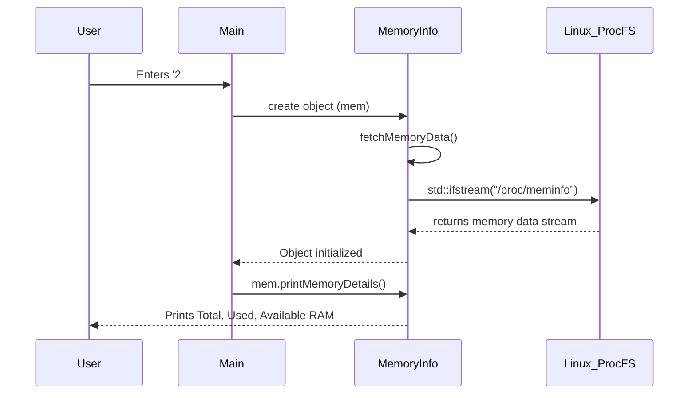

# System Design and Architecture

## 1. System Architecture Diagram
The architecture of this project is a simple User-Space C++ Application that interfaces with the Linux Kernel via system calls and pseudo-filesystems.

## 2. Class Diagram
The C++ application uses a modular, object-oriented design where each system component being monitored is encapsulated within its own class.

## 3. Sequence Diagram (Example: Reading Memory)

## 4. Developer Notes
- **Encapsulation**: All data fetching happens automatically in the constructors of the classes, keeping `main.cpp` extremely clean and simple.
- **Git Strategy**: We are committing code sequentially after each functional module is developed.
